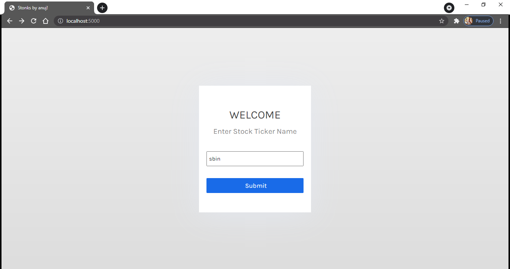
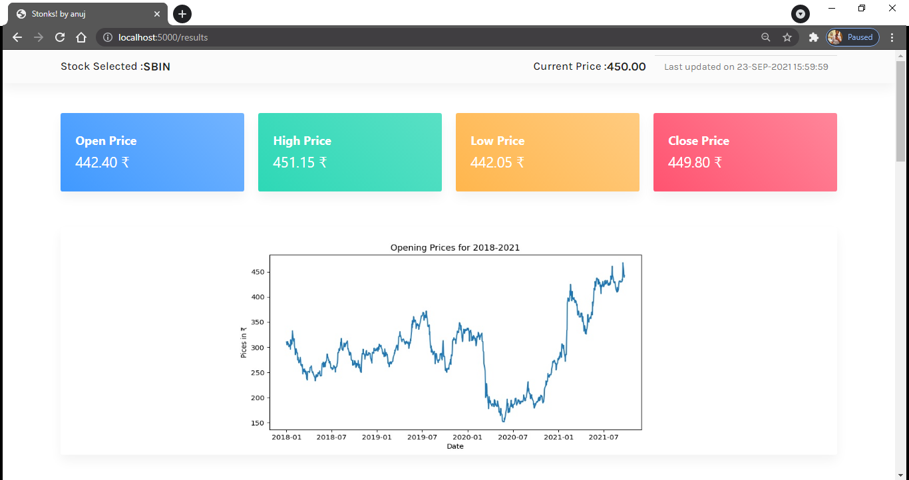
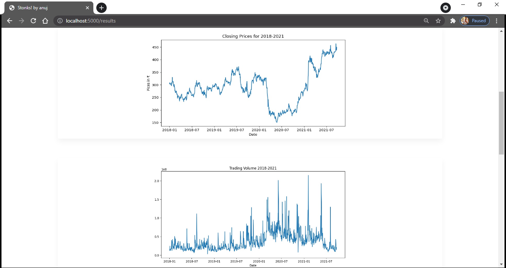
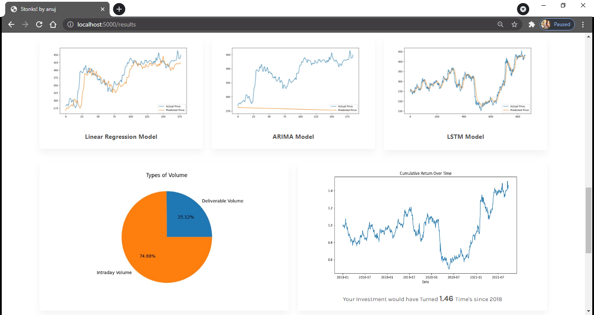
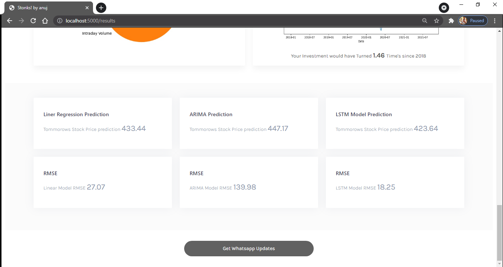
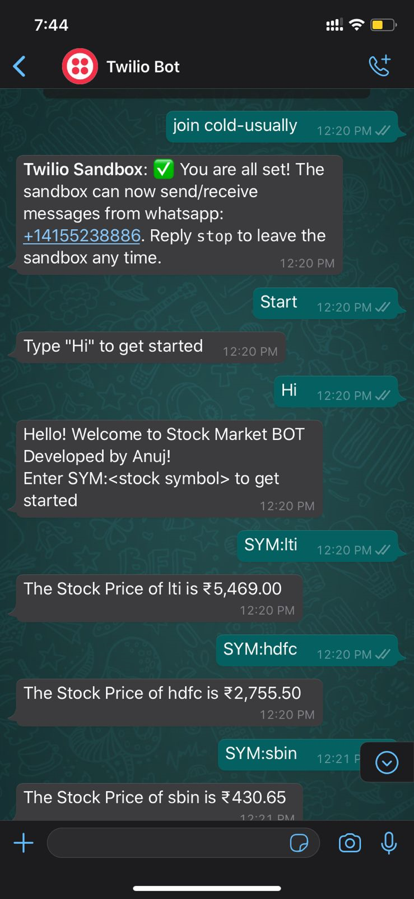

# Stock-Price-Prediction-with-WhatsApp-Chatbot-Integration


# Description

Stock Price Analysis and Prediction is a web-app that implements Machine Learning Algorithms and a simple WhatsApp-based Chatbot. The Web App's front end is built with Python's Flask Framework. The app anticipates stock closing values for successive day(next day) for any particular stock that is listed on NSE India (www1.nseindia.com) website. Three algorithms are used to make predictions: Linear Regression, Auto-ARIMA, and LSTM. The dashboard displays the whole analysis as well as the predicted stock price along with RMSE Score. Additionally, the applications allows the users to engage with a WhatsApp-based Chatbot that retrieves the current stock price of the stock. Additionally this app could be Deployed onto Platforms such as AWS EC2 or Heroku as well.

# Screenshots









# Directory Structure
```
|-- ARIMA_Model.py   - Scripts for ARIMA Model
|-- ChatBot.py       - Python Scripts for Whatsapp Chatbot
|-- Include          
|-- LSTM_Model.py    - Scripts for ARIMA Model
|-- Lib              
|   `-- site-packages
|-- Linear.py        - Scripts for Liner Regression Model
|-- analysis.py      - Scripts related to all Analysis and Visualizations
|-- app.py           - Flasks app.py (entry-point)
|-- ngrok.exe         
|-- pyvenv.cfg
|-- requirements.txt
|-- Screenshots         
|-- static           - Static Directory for CSS and media files
|   |-- AM.jpg
|   |-- Close_price.jpg
|   |-- Cum_Ret.jpg
|   |-- LR.jpg
|   |-- LSTM.jpg
|   |-- Open_price.jpg
|   |-- Pie_Chart.jpg
|   |-- Volume.jpg
|   |-- sample.png
|   |-- style.css
|   `-- styles2.css
`-- templates         - Templates for HTML Pages
    |-- 404.html
    |-- index.html
    `-- results.html

```
# Technologies and Frameworks Used


- Flask
- Tensorflow
- Keras
- NSEpy
- Scikit-Learn
- Twilio
- Python
- BootStrap 5
- Ngrok


# Setup and Installations 

Make sure you have installed ***Python 3.8.10*** on your system <br>
***Note*** : Additional Steps are required for Activating WhatsApp ChatBot Services

1. Clone the repo and Setup a new venv for the Application
2. Launch the venv and install the dependencies :
```sh
pip install -r requirements.txt
```

3. Launch the Flask App:

```sh
python app.py
```

## Steps for Activating Chatbot Service

1. Setup Your Twilio Account for WhatsApp Messaging Services
2. Copy and Paste the following API Keys from Twilio Account to app.py


ACCOUNT_ID = '<36 - digit key>'<br>
TWILIO_TOKEN = '<34 - digit key>'<br>
TWILIO_NUMBER = 'whatsapp:+XXXXXXXXXXX'

3. Save the Code and Launch the Flask Application and Note Down the port Number

```sh
python app.py
```
4. Launch ngrok.exe and Enter
```
ngrok.exe http <Flask Port Number usually 3000>
```

5. Navigate to Twilio and Mention the ***https*** URL generated by ngrok as webhook 

## Steps for Deploying on AWS EC2

1. Login to AWS Account; Navigate to EC2 Services

2. Setup a new Ubuntu Instance and store the .pem file. Enable SSH Access on Port 22.

3. Using following commands on Local Machine copy the files to ec2 instance.

``` 
tar -cvf compressed.tar <folder location>
```

```
scp -i <pemfile.pem> compressed.tar ubuntu@<ipaddress>:~/
```
4. Login to EC2 instance using

```
ssh -i <pemfile.pem> ubuntu@<ip address> 

tar -xvf compressed.tar

pip install -r requirements.txt

python app.py
```

5. Under EC2 Security group enable Inbound Rule for TCP Traffic for Flask port.


# Authors


- LinkedIn : [***Anuj Sharma***](https://www.linkedin.com/in/anujsharma787/)
